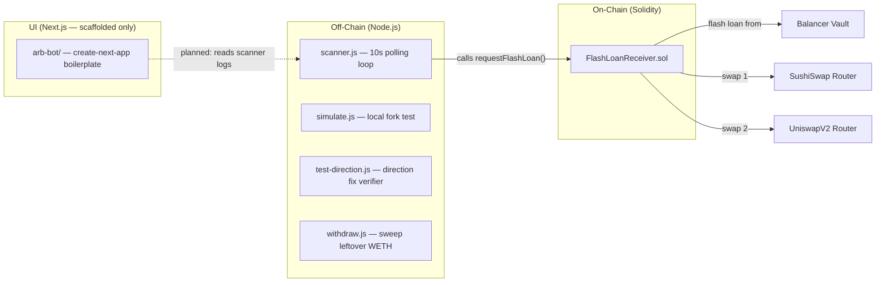

# Flash Loan Arbitrage Bot — Project Analysis

## Overview

A **Balancer V2 flash loan arbitrage bot** that exploits WETH/USDC price discrepancies between **SushiSwap** and **Uniswap V2**. The system is split into two workspaces: a **Hardhat smart contract project** and a **Next.js dashboard UI** (currently scaffolded but not built out).

---

## Architecture (3 Pieces)

---

## Component Breakdown

### 1. Smart Contract — [`FlashLoanReceiver.sol`](file:///c:/Users/HOME%20PC/Desktop/Arbitrage%20bot/contracts/contracts/FlashLoanReceiver.sol)

| Feature | Detail |
|---|---|
| **Solidity version** | `^0.8.10` (compiled with `0.8.28` via Hardhat 3) |
| **Flash loan source** | Balancer V2 Vault (`0xBA12222...`) — fee-free flash loans |
| **Trade pair** | WETH ↔ `tokenB` (USDC, set at deploy time — not hardcoded) |
| **DEXes** | `dexA` and `dexB` (SushiSwap + UniswapV2 routers, set at deploy) |
| **Direction flag** | `buyOnA` — when `true`, sells on dexA first (dexA is expensive), buys back on dexB (dexB is cheap) |
| **Slippage protection** | On-chain `getAmountsOut()` quotes with `slippageToleranceBps` (default 1%, max 10%, owner-adjustable) |
| **Reentrancy guard** | Custom `nonReentrant` on `requestFlashLoan()` only — correctly NOT on `receiveFlashLoan()` (Balancer callback) |
| **Events** | `LoanExecuted`, `StepCompleted` ×2, `ArbitrageResult`, `Withdrawn` |
| **Withdraw** | Owner can sweep any ERC-20 token from the contract |

**Execution flow:**
1. Owner calls `requestFlashLoan(WETH, amount, buyOnA)`
2. Balancer calls back `receiveFlashLoan()` with the borrowed WETH
3. **Swap 1:** WETH → USDC on the expensive DEX (sell high)
4. **Swap 2:** USDC → WETH on the cheap DEX (buy low)
5. Repay Balancer the original loan (+ 0 fee for Balancer V2)
6. Keep the WETH difference as profit

---

### 2. Scanner — [`scanner.js`](file:///c:/Users/HOME%20PC/Desktop/Arbitrage%20bot/contracts/scripts/scanner.js)

The off-chain brain. Runs as a long-lived Node.js process polling every 10 seconds.

**Key logic:**

| Feature | Detail |
|---|---|
| **Network support** | `anvil-fork` (default, local) and `sepolia` (addresses filled `contracts/scripts/scanner.js:21`, on-chain dex mismatch still pending redeploy) |
| **Pool depth check** | Fetches reserves from both factories, skips if either pool has < $100k USDC liquidity |
| **Dynamic loan sizing** | `POOL_PCT` (1%) of the shallower pool's WETH reserve, clamped to [0.05, 5] WETH |
| **Profit estimation** | Accounts for 0.3% DEX fee **AND** full slippage tolerance per swap — deliberately pessimistic |
| **Gas-aware threshold** | `gasCost × safetyMultiplier` vs `MIN_PROFIT_FLOOR_WETH` — recalculated every scan |
| **Direction fix** | `buyOnA = !buyOnSushi` — inverts the scanner's "buy on Sushi" signal to match the contract's "sell on dexA first" semantics |
| **Auto-withdraw** | After a successful arb, immediately calls `contract.withdraw(WETH)` to sweep profit to wallet |
| **Structured logging** | Every event emitted as JSON (`bot_started`, `scan_checked`, `opportunity_found`, `execute_start`, `execute_success`, etc.) + SQLite via `lib/events.ts` + `DRY_RUN` (`dry_run_would_execute`) |

**Configuration (all env-tunable):**

| Variable | Default | Purpose |
|---|---|---|
| `POOL_PCT` | 0.01 (1%) | Fraction of shallower pool's WETH to borrow |
| `MIN_LOAN_WETH` | 0.05 | Loan size floor |
| `MAX_LOAN_WETH` | 5 | Loan size ceiling |
| `GAS_ESTIMATE_UNITS` | 450,000 | Gas units for threshold calc |
| `PROFIT_SAFETY_MULTIPLIER` | 2× | How much above gas cost profit must clear |
| `MIN_PROFIT_FLOOR_WETH` | 0.001 | Absolute minimum profit threshold |
| `SLIPPAGE_BUFFER_BPS` | 100 (1%) | Must match contract's `slippageToleranceBps` |

---

### 3. Test Scripts

| Script | Purpose |
|---|---|
| [`simulate.js`](file:///c:/Users/HOME%20PC/Desktop/Arbitrage%20bot/contracts/scripts/simulate.js) | Full end-to-end test: deploys fresh contract on fork, funds with 0.1 WETH, executes a 1 WETH flash loan with `buyOnA=false`, measures profit |
| [`test-direction.js`](file:///c:/Users/HOME%20PC/Desktop/Arbitrage%20bot/contracts/scripts/test-direction.js) | One-off verification of the direction fix: checks real prices, picks correct direction, executes 0.629 WETH loan, confirms profit (not loss) |
| [`withdraw.js`](file:///c:/Users/HOME%20PC/Desktop/Arbitrage%20bot/contracts/scripts/withdraw.js) | Sweeps leftover WETH from a specific contract address — used between test runs to avoid subsidized results |

---

### 4. UI — [`arb-bot/`](file:///c:/Users/HOME%20PC/Desktop/Arbitrage%20bot/arb-bot)

**Current state: Phases 1–4 done, 5–6 pending.**

- Next.js 16.3.1 with App Router, React 19, TypeScript, Tailwind CSS v4
- `app/layout.tsx` — 0xAurora header + StatusRing (live 10s) + Navigation
- `app/page.tsx` — Dashboard 3-card grid live via `/api/status` (fallback hardcoded), dry-run badge
- `app/logs/page.tsx` + `components/LogsTable.tsx` — reads `runs` from SQLite via `/api/logs`, 5s polling, handles `dry_run` badge
- `app/scanner/page.tsx` + `components/ScannerFeed.tsx` — reads `scans` from SQLite via `/api/scans`, 10s polling
- `app/execute/page.tsx` + `components/StepsBreakdown.tsx` — real execution via `lib/contract.ts` (receipt + `StepCompleted` parsing, `dry_run` + simulation fallback) with 1s polling
- `lib/db.ts` — `scans` + `runs` tables (better-sqlite3), `lib/events.ts` — `recordScan`/`recordRun` ingestion
- `scanner-service/scanner.js` — standalone writer to `bot_data.sqlite` with `DRY_RUN` support

| Page | Purpose | Status |
|---|---------|--------|
| `/` (Dashboard) | Bot status, wallet balance, network selector, live status ring | ✅ Static done, live wiring Phase 6 |
| `/execute` | Trigger `requestFlashLoan`, live step-by-step breakdown | 🟡 Mock done, real streaming Phase 5 |
| `/logs` | Historical run table from SQLite | ✅ Live from DB |
| `/scanner` | Live scanner feed from SQLite | ✅ Live from DB |
| `API routes` | `/api/status` + `/api/execute` + `/api/execute/status` + `/api/logs` + `/api/scans` | ✅ All live — `/api/status` returns wallet/balances/lastScan/lastRun |

**Design language:** Dense instrument panel — deep slate (`#12151C`), copper accent (`#C08A3E`), Space Grotesk + Inter + JetBrains Mono. Signature element: live status ring (Phase 6).

---

## Project Status — by Phase (updated 2026-08-30)

| Phase | Area | Status |
|-------|------|--------|
| 1 | Scaffold + tokens/layout | ✅ Done — build passes |
| 2 | Static Dashboard | ✅ Done — `/` prerendered |
| 3 | SQLite ingestion + Dry-run | ✅ Done — `DRY_RUN` + `bot_data.sqlite` writes verified (2 scans + 1 dry_run inserted) |
| 4 | Logs + Scanner feed (alive) | ✅ Done — 5s/10s polling, `dry_run` badge |
| 5 | Execute panel + live steps | ✅ Done — real `ethers` + `StepCompleted` parsing, `dry_run` path, simulation fallback, DB writes |
| 6 | Status ring + polish | ✅ Done — 10s ring, live `/api/status` + Dashboard balances, dry-run badge |
| — | Contract logic | ✅ Complete, direction bug fixed |
| — | Scanner core | ✅ Complete + `DRY_RUN` added |
| — | Forked mainnet validation | ✅ Verified profitable (+0.0107 WETH) |
| — | Sepolia deployment | ⏸️ Parked — addresses now filled (`contracts/scripts/scanner.js:21`), but on-chain `0x77EC85…` still `dexA/B=0xd9e1…` mismatch; needs redeploy + `sushiLiq ~499` thin |
| — | Automated tests | ✅ Contract 8 Solidity tests (`contracts/FlashLoanReceiver.t.sol:1`, `npm test` 8 passing) — scanner JS still manual |
| — | MEV protection | ❌ Not implemented (parked until pre-Arbitrum) |

---

## Key Design Decisions Worth Noting

1. **No hardcoded token addresses in the contract** — `tokenB`, `dexA`, `dexB` are all constructor args, making it deployable on any EVM chain
2. **Balancer V2 for flash loans** — 0% fee, unlike Aave's 0.09%
3. **The direction bug** — `buyOnA` (contract) ≠ `buyOnSushi` (scanner). The fix: `buyOnA = !buyOnSushi`. Without this, every trade would have sold low and bought high
4. **Pessimistic profit estimation** — accounts for both DEX fees AND full slippage tolerance. This means fewer false triggers but safer executions
5. **Auto-withdraw after profit** — profits are immediately swept to the wallet, not left sitting in the contract

> [!WARNING]
> The `.env` file contains a **private key** and an **Alchemy API key** in the repo. The private key (`0xac0974...`) is Hardhat's default test account (account #0), so it's not a real key — but the Alchemy key is real and should not be committed.

---
